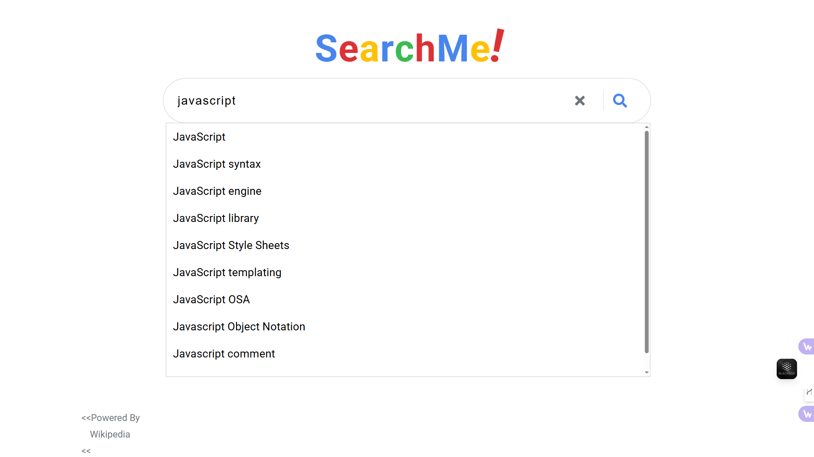

## Wikipedia Search Application

This is a normal search engine application that allows users to search for information on Wikipedia. It uses the Wikipedia API to fetch search results and displays them in a user-friendly interface.

## Overview

A clean, responsive search engine application built exclusively for Wikipedia content. This project leverages the Wikipedia API to deliver instant search results, providing a streamlined interface for exploring Wikipedia's vast knowledge base.

## Technologies Used

- HTML
- SASS (CSS Preprocessor for Compiling Regular Cascading)
- JavaScript (No Third Party Package)
- Wikipedia API for Data

## Features

**Instant Search Result**: Real time autocomplete search result suggestions as you type.

**Search Bar Icon**: Click the search icon to display results or cross icon to remove text.

**Clean UI**: Simple, minimalist interface focused on content and readability.

**Direct links**: Quick access to full wikipedia articles.

## Usage

1. Type or enter your search query in the search bar.
2. Press Enter or click the search button.
3. View the search results displayed below, with titles from wikipedia.
4. Click on a result to open the full Wikipedia article in a new tab.
5. Use the clear cross button to reset your search.

## Screenshots





## Installation

Follow these steps to set up the project locally:

 1. **Clone the Repository:**

```bash
git clone https://github.com/minhazhalim/Wikipedia-Search-Application.git
```
2. **Navigate to the Project Directory:**

```bash
cd Wikipedia-Search-Application
```
3. **Download Node.js JavaScript Runtime Software:**

   Before you open the main ```HTML``` index application file, you need to download Node.js software first. Go to link - ```https://nodejs.org/en/``` and download the latest version of Node.js CLI application ```.exe``` file and install it.

4. **Install Live-Server Plugin**:

   After installing the Node.js CLI application, open your windows terminal or command prompt and type - ```npm install --global live-server``` and hit 'Enter'. With few seconds it will installed in you computer.

4. **How to Use**:

   Now click the right of folder 'Wikipedia-Search-Application' and open your windows terminal or command prompt cli tool. type - ```live-server --port=8080``` and hit 'Enter'. The application server will automatically open ```index.html``` file in your browser.
   
## How it Works

- The application uses JavaScript to send a request to the Wikipedia API with the user's search query.

- The API returns a JSON response containing the search results.

- The JavaScript code parses the response and dynamically generates HTML elements to display the results.


## API Integration

#### This project utilizes the [Wikipedia API](https://www.mediawiki.org/wiki/API:Main_page)


- ```/w/api.php?action=query&generator=search&gsrsearch```: For main search results for fetching search results. The key endpoints used are:
- ```&gsrlimit=20&prop=pageimages|extracts&exchars```: For retrieving thumbnail images if available.
- ```&exintro&explaintext&exlimit=max&format=json&origin```: For article snippets.

**API Calls**

```base
const getWikiSearchString = (searchTerm) => {
    const maximumCharacters = getMaximumCharacters();
    const rawSearchString = `https://en.wikipedia.org/w/api.php?action=query&generator=search&gsrsearch=${searchTerm}&gsrlimit=20&prop=pageimages|extracts&exchars=${maximumCharacters}&exintro&explaintext&exlimit=max&format=json&origin=*`;
    const searchString = encodeURI(rawSearchString);
    return searchString;
};
```

**Autocomplete Suggestions**

```base
export const getSuggestions = async (stringText) => {
    if(!stringText) return [];
    const apiUrl = `https://en.wikipedia.org/w/api.php?action=opensearch&search=${encodeURIComponent(stringText)}&limit=10&namespace=0&format=json&origin=*`;
    try {
        const response = await fetch(apiUrl);
        const result = await response.json();
        return result[1];
    }catch(error){
        console.log(error);
        return [];
    }
};
```
## Contributing

Contributions are welcome! Please feel free to submit a Pull Request.

1. Fork the repository
2. Create your feature branch ```git checkout -b feature/amazing-feature```
3. Commit your changes ```git commit -m 'Add some amazing feature'```
4. Push to the branch ```git push origin feature/amazing-feature```
5. Open a pull request
